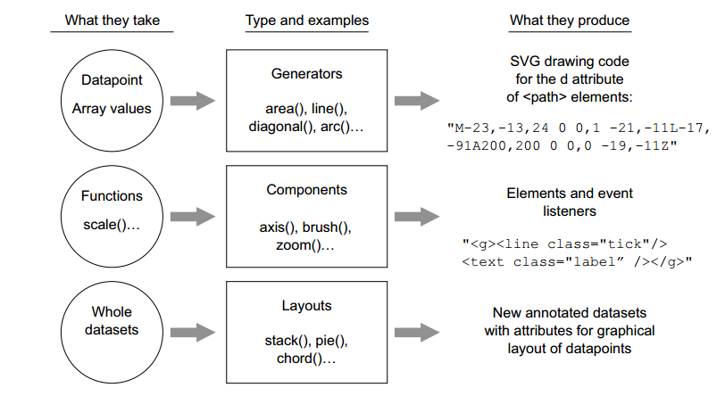

# Scene
- chart (bar、line、pie)
- data dashboards
- reports
- animation (i.e. flash)
- games
- etc


# What is d3.js
- **D3 (Data-Driven Documents or D3.js)** is a JavaScript library for visualizing data using web standards. 
- D3 helps you bring data to life using **SVG**, **Canvas** and **HTML**.
- D3 combines powerful visualization and interaction techniques with a **data-driven approach to DOM manipulation**, giving you the **full capabilities of modern browsers** and the **freedom to design** the right visual interface for your data.
- d3.js ≠ charting library
- [d3 Example](https://github.com/d3/d3/wiki/Gallery)

## SVG
SVG（Scalable Vector Graphics）可缩放矢量图形，是一种用来描述二维矢量图形的**XML 标记语言**。 简单地说，SVG面向图形，HTML面向文本。

SVG与Flash类似，都是用于二维矢量图形，二者的区别在于，SVG是一个W3C标准，基于XML，是开放的，而Flash是封闭的基于二进制格式的。因为都是W3C标准，SVG与其他的W3C标准，比如CSS, DOM和SMIL等能够协同工作。

```
<svg version="1.1" 
    xmlns="http://www.w3.org/2000/svg"
    width="200" height="200" 
    style="border:1px solid lightgrey;">

    <rect x="50" y="50" width="100" height="100" fill="red" />

    <circle cx="100" cy="100" r="50" fill="green" />
</svg>
```

## Canvas
<canvas> 是 HTML5 新增的元素，可用于通过使用JavaScript中的脚本来绘制图形。 或者说，<canvas>是一个可以使用脚本(通常为JavaScript)在其中绘制图形的 HTML 元素。  

WebGL也使用<canvas>元素在网页上绘制硬件加速的3D图形。

- Canvas 的默认大小为300像素×150像素（宽×高，像素的单位是px）
- 为了在 Canvas 上绘制图形，我们使用一个JavaScript**上下文对象**，它能动态创建图像

```
<canvas id="canvas" width="150" height="150"></canvas>

var canvas = document.getElementById('canvas');
var ctx = canvas.getContext('2d');

ctx.fillStyle = "red";
ctx.fillRect (10, 10, 50, 50);

```

# How 

## Selections(选择器) & binding
- selection.select
- selection.selectAll
- selection.data
- selection.enter
- selection.append
- selection.attr
- selection.style

```
d3.select("#infoviz")
    .selectAll("p")
    .data([12, 14, 16])
    .enter()
    .append('p')
    .text(function (d) { return "hello. font-size:" + d + "px"; })
    .style("font-size", function (d) { return d + "px"; });
```

## enter & exit
- selection.enter   //为缺失的元素返回占位符
- selection.append  //创建并追加一个新元素
- selection.exit    //返回不再需要的元素
- selection.remove  //从当前文档中移除当前元素

```
// Update…
var p = d3.select("#infoviz")
    .selectAll("p")
    .data(data)
    .text(function (d) { return d; });

// Enter… 当data binding的个数大于等于selection选择的元素个数时，触发
p.enter().append("p")
    .text(function (d) { return d; });

// Exit… 当data binding的个数小于selection选择的元素个数时，触发
p.exit().remove();
```

## transition 过渡
- d3.transition //开启一个动画过渡
- d3.delay      //指定每个元素的延迟时间（以毫秒为单位）
- d3.duration   //指定每个元素的持续时间（以毫秒为单位）
```
d3.selectAll('circle')
    .transition()
    .delay(1000)
    .duration(1000)
    .attr('r', 25)
```

## chart（图表） & scale(比例)
- d3.scale.linear -> d3.scaleLinear 
- d3.svg.axis -> d3.axis [Components]
- d3.svg.line -> d3.line [Generators]

### scale


```js
var scale = d3.scaleLinear() //线性比例尺
.domain([1000,100000])
.range([10,300]);
console.log(scale(1000)); //10
console.log(scale(50000)); //153.53535353535355
console.log(scale(100000)); //300
```

- d3.scaleQuantize - 构建一个量化比例尺（值域离散）
- d3.scaleOrdinal - 构造一个序数比例尺
- d3.scaleTime - 时间比例尺
- etc...

### d3.axis 
    
```js
var xAsix = d3.axisBottom(xScale);

svg.append('g')
    .attr('transform', `translate(0, 0)`)
    .attr('id', 'xAsix')
    .call(xAsix);
```
.call() 生成了
```html
<g>
    <path />
    <g class="tick">
        <line />
        <text />
    </g>
<g>
```
### d3.line 

```js
var data = [
    { friends: 5, salary: 22000, name: '张三', id: '1' },
    { friends: 3, salary: 18000, name: '李四', id: '2' }
            
var line = d3.line()
    .x(function (d) { return xScale(d.salary); })
    .y(function (d) { return yScale(d.friends); });
    
svg.append('path')
    .attr('d', line(data))
```


## pie
- d3.layout.pie -> d3.pie 
- d3.svg.arc -> d3.arc 


### d3.pie [Layout]
```
var data = [1, 1, 2, 3];
var arcs = d3.pie()(data);

console.log(arcs);

[
    {data: 1, index: 2, value: 1, startAngle: 4.487989505128276, endAngle: 5.385587406153931, …}
    {data: 1, index: 3, value: 1, startAngle: 5.385587406153931, endAngle: 6.283185307179586, …}
    {data: 2, index: 1, value: 2, startAngle: 2.6927937030769655, endAngle: 4.487989505128276, …}
    {data: 3, index: 0, value: 3, startAngle: 0, endAngle: 2.6927937030769655, …}
]
```

### d3.arc [Generators]

```
var arc = d3.arc()
  .outerRadius(50)
  .innerRadius(25);

console.log(arc(arcs[0]));
// M-48.74639560909118,11.126046697815726A50,50,0,0,1,-39.09157412340149,-31.17449009293667L-19.545787061700747,-15.587245046468334A25,25,0,0,0,-24.37319780454559,5.563023348907863Z

```

### 绘制pie
```
// 生成一个扇区
d3.select('#svg')
.append('g')
.attr("transform", "translate(150,150)")
.append('path')
.attr('d', arc(arcs[0]))
.style('stroke', 'red')
.style('stroke-width', 2)

// 生成pie
d3.select('#svg')
  .append('g')
  .attr("transform", "translate(150,150)")
  .selectAll('path')
  .data(arcs)
  .enter()
  .append('path')
  // .attr('d', arc2)
  .attr('d', (d) => {
    return arc(d);
  })
  .style('fill', 'blue')
  .style('stroke', 'white')
  .style('stroke-width', 2)
```

# More

## d3 API
- 核心 - 包括选择器，过渡，数据处理，本地化，颜色等。
- 地理 - 球面坐标，经纬度运算。
- 几何 - 提供绘制2D几何图形的实用工具。
- 布局 - 推导定位元素的辅助数据。
- 比例尺 - 数据编码和视觉编码之间转换。
- 可缩放矢量图形 - 提供用于创建可伸缩矢量图形的实用工具。
- 时间 - 解析或格式化时间，计算日历的时间间隔等。
- 行为 - 可重用交互行为

## d3 functionality 功能分类
- Generators  
- Components  
- Layouts  




# 参考链接
- [MDN-SVG简介](https://developer.mozilla.org/zh-CN/docs/Web/SVG)
- [MDN-Canvas简介&教程](https://developer.mozilla.org/zh-CN/docs/Web/API/Canvas_API)
- [d3 github wiki](https://github.com/d3/d3/wiki)
- [d3入门教程](http://pkuwwt.github.io/d3-tutorial-cn/about.html)
- [[Manning d3 In Action] 电子书](https://pan.baidu.com/s/1gd0AtbX#list/path=%2F)
- [Changes in d3 4.0](https://github.com/d3/d3/blob/master/CHANGES.md)